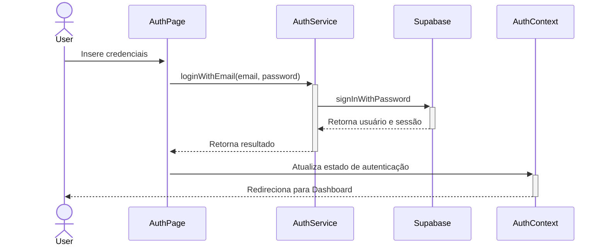
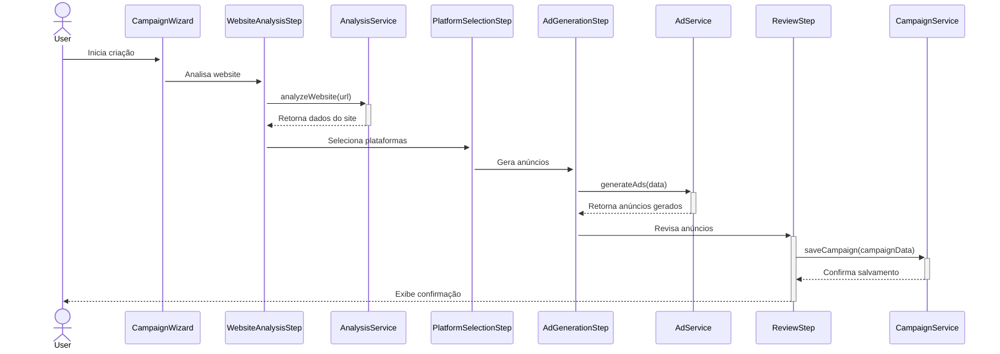

# Documentação de Arquitetura - AI Ad Guru

## Visão Geral

O AI Ad Guru é uma aplicação SaaS para automação de criação de anúncios usando inteligência artificial. A arquitetura do projeto segue princípios modernos de desenvolvimento frontend, com foco em modularidade, reutilização e manutenibilidade.

## Estrutura do Projeto

```
src/
├── components/     # Componentes React reutilizáveis
├── contexts/       # Contextos React para gerenciamento de estado global
├── hooks/          # Hooks personalizados para lógica reutilizável
├── integrations/   # Integrações com serviços externos (Supabase, etc.)
├── lib/            # Bibliotecas e utilitários
├── pages/          # Componentes de página
├── services/       # Serviços e APIs
│   ├── ads/        # Serviços relacionados a anúncios
│   ├── auth/       # Serviços de autenticação
│   ├── campaigns/  # Serviços relacionados a campanhas
│   └── ...
├── tests/          # Testes automatizados
│   ├── components/ # Testes de componentes
│   ├── hooks/      # Testes de hooks
│   └── services/   # Testes de serviços
└── utils/          # Funções utilitárias
```

## Fluxos Principais

### 1. Autenticação



### 2. Criação de Campanha



## Padrões Arquiteturais

### 1. Hooks Centralizados

Utilizamos hooks personalizados para encapsular lógica reutilizável:

- `useErrorHandler`: Tratamento padronizado de erros
- `useFormValidation`: Validação de formulários com Zod
- `useAICampaignSetup`: Configuração de campanhas com IA

### 2. Lazy Loading

Implementamos lazy loading para otimizar o carregamento inicial:

```jsx
// Exemplo em router.tsx
const HomePage = lazy(() => import('@/pages/HomePage'));
const DashboardPage = lazy(() => import('@/pages/DashboardPage'));
```

### 3. Tratamento de Erros

Adotamos uma abordagem centralizada para tratamento de erros:

```jsx
// Exemplo de uso do hook de erro
const { handleApiError } = useErrorHandler();

try {
  // Operação que pode falhar
} catch (error) {
  handleApiError(error, 'Mensagem amigável');
}
```

### 4. Validação de Formulários

Utilizamos Zod para validação de esquemas:

```jsx
// Exemplo de uso do hook de validação
const { validateForm } = useFormValidation();

const userSchema = z.object({
  name: z.string().min(3),
  email: z.string().email()
});

const validatedData = validateForm(userSchema, formData);
```

## Fluxo de Dados

1. **Estado Local**: Gerenciado com `useState` e `useReducer`
2. **Estado Global**: Gerenciado com Context API
3. **Persistência**: Armazenamento no Supabase
4. **Comunicação API**: Através de serviços dedicados

## Considerações de Performance

1. **Code Splitting**: Implementado com React.lazy e Suspense
2. **Importações Seletivas**: Para reduzir tamanho do bundle
3. **Memoização**: Uso de useMemo e useCallback para componentes pesados
4. **Renderização Condicional**: Para evitar renderização desnecessária

## Testes

Implementamos testes automatizados para:

1. **Componentes**: Testes de renderização e interação
2. **Hooks**: Testes de comportamento e estado
3. **Serviços**: Testes de integração com APIs

## Convenções e Padrões

1. **Nomenclatura**: Seguimos o guia de padronização documentado
2. **Estrutura de Arquivos**: Organização modular e consistente
3. **Estilo de Código**: Formatação automática com Prettier
4. **Tipagem**: TypeScript para segurança de tipos

## Próximos Passos

1. **Otimização de Dependências**: Reduzir tamanho do bundle
2. **Feedback Visual**: Melhorar estados de carregamento e erro
3. **Documentação Contínua**: Manter documentação atualizada
